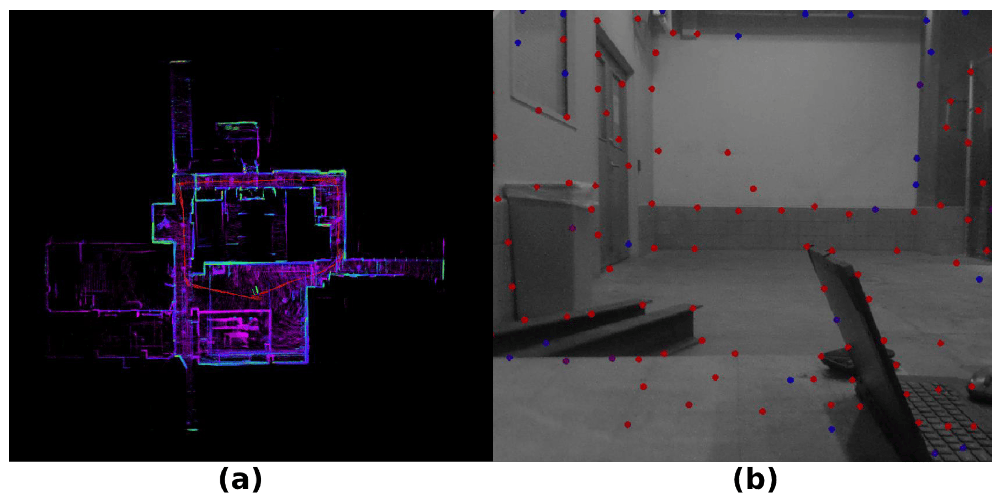

# 📌 A Review and Benchmarking of Simultaneous Localization and Mapping for the Robotic-Based Nondestructive Evaluation of Infrastructures
**A repository for SLAM algorithm benchmarking in GPS-denied environments.**

This repository contains **benchmarking codes and evaluation results** for various SLAM algorithms tested under **GPS-denied and enclosed environments (EGD)**. The study investigates **vision-based, LiDAR-based, and LiDAR-vision fusion methods** for robotic infrastructure inspection.

---

## 📝 Publication
- 📝 **Title:** A Review of Simultaneous Localization and Mapping for the Robotic-Based Nondestructive Evaluation of Infrastructures
- 📚 **Journal:** Sensors
- 🔗 **[Read the Full Paper](https://www.mdpi.com/1424-8220/25/3/712)**

---


<h3 style="color:blue;">🔹 SLAM Algorithms Evaluated</h3>

This study benchmarks the following **SLAM methods**:

| **Algorithm**  | **Type** | **Sensor Modality** |
|---------------|----------|--------------------|
| ORB-SLAM2     | Visual   | Monocular, Stereo, RGB-D |
| VINS-Mono     | Visual   | Monocular Camera IMU  |
| LIO-SAM       | LiDAR    | LiDAR + IMU       |
| Fast-LIO2     | LiDAR    | LiDAR + IMU       |
| A-LOAM        | LiDAR    | LiDAR + IMU       |
| LVI-SAM       | Fusion   | LiDAR + Camera + IMU |
| LINS          | LiDAR    | LiDAR + IMU       |
| LEGO-LOAM     | LiDAR    | LiDAR + IMU |
| SC-LEGO-LOAM  | LiDAR    | LiDAR + IMU |
| SC-FAST-LIO   | LiDAR    | LiDAR + IMU |
| F-LOAM        | LiDAR    | LiDAR + IMU |

---

## 📊 Results

<h3 style="color:green;">📌 Trajectory Error Comparison</h3>
The results include:
- **Accuracy Comparisons:** RMSE plots showing SLAM accuracy
- **Computational Resource Consumption:** Memory and CPU usage and runtime benchmarks
- **Visualizations:** 3D trajectory plots

### **Example Visualizations**
<p><span style="font-size:18px; font-weight:bold;">🔹 Accuracy Comparison:</span></p>

<div align="center">


</div>

<p><span style="font-size:18px; font-weight:bold;">🔹 Dataset Collection results:</span></p>

<div align="center">

</div>

<p><span style="font-size:18px; font-weight:bold;">🔹 Dataset Collection Device:</span></p>

<div align="center">

</div>


📌 **More detailed results can be found in the results section of the corresponding paper.**

---

## 🚀 How to Use This Repository
Since this repository **only contains benchmarking codes**, there are no installation steps required. However, to **reproduce the benchmarking results**, follow these steps:

1. Clone the repository:
   ```bash
   git clone https://github.com/ali-qdmz/A-Review-of-SLAM-and-Benchmarking.git
   cd A-Review-of-SLAM-and-Benchmarking
   ```
2. Run the relevant SLAM benchmarking script:
   ```bash
   python benchmark_scripts/orb_slam2.py
   ```

## 📩 Contact
For any questions or collaboration opportunities, feel free to reach out:

👤 **Ali Ghadimzadeh Alamdari**  
📧 **[ali.ghadimzadeh@gmail.com]**  
🔗 **[[LinkedIn](https://www.linkedin.com/in/ali-ghadimzadeh-38b12217a/)]** 
---
